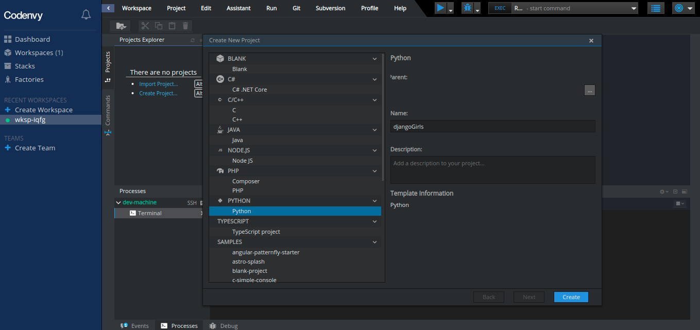
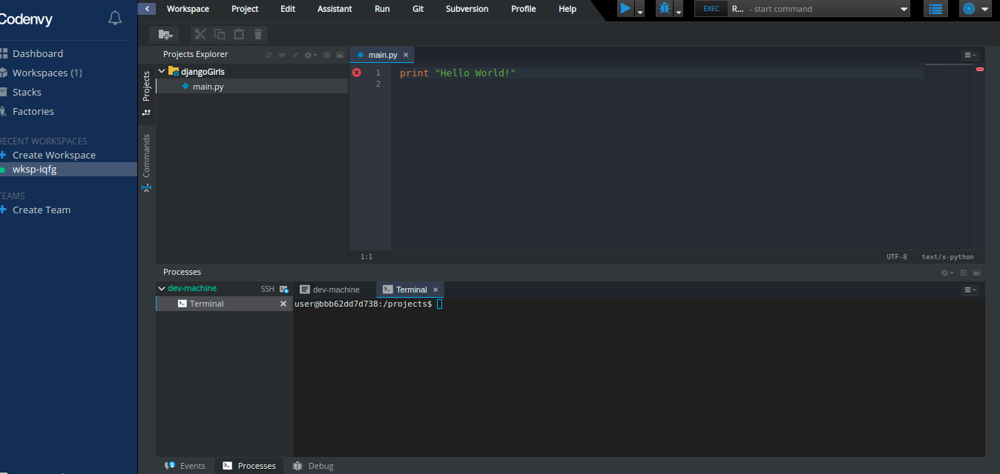

# README

Você está prestes a escrever sua primeira linha de código, então precisamos de um editor de código!

Existem muitos editores diferentes e em grande parte se resume a preferência pessoal. A maioria das pessoas que programam em Python usam as complexas, mas extremamente poderosas IDEs \(Integrated Development Environments, ou em português, Ambiente de desenvolvimento Integrado\), tais como PyCharm.

Para o tutorial, usaremos o editor do Codenvy Para isso, basta criar um novo projeto, clicando no link em azul “Create New Project”, na tela acima do prompt, escolha a opção Python e coloque o nome do projeto 'djangoGirls':

Um novo projeto será criado, e irá aparecer uma pasta com o nome dele e dentro dela um arquivo chamado 'main.py'. Clique duas vezes em cima deste arquivo, ao lado irá aparecer uma janela escrito 'print "Hello World":

Também podemos utilizar outros editores de código, como Sublime, VSCode, e etc.., para este projeto iremos utilizar a plataforma Codenvy.

