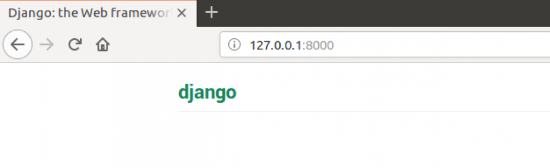

# Criando uma conta

O primeiro passo para utilizarmos o Gitpod é criar uma conta no Github. O Github é uma plataforma de hospedagem de código, permitindo que programadores de qualquer parte do mundo contribuam para diversos projetos.

Quando você acessar o link, indicado na seção Gitpod \(link rápido [aqui](https://gitpod.io/#https://github.com/dgtaquara/dg-workspace)\), e não estiver com o acesso no Github, verá a seguinte tela.

Vamos clicar no botão `Login with GitHub & Launch Workspace`. Você verá a tela a seguir:

Se tiver uma conta do GitHub, é só colocar seu usuário e senha. Caso contrário, clique em `Create an account` na parte inferior da tela. Ao clicar nessa opção de criar uma nova conta, você será redirecionada para um formulário pedindo nome, email, usuário e senha. Para continuar, preencha este formulário \(não esqueça de utilizar um e-mail válido que você tenha acesso!\)

## Escolha o plano FREE

Depois de inserir seus dados para uma nova conta, escolha o plano gratuito clicando em `Choose Free`.

## Valide seu e-mail

É necessário que você valide seu e-mail, então certifique-se de ter acesso a ele.

## Caso já tenha conta

Se loga aê e toca ficha :D

