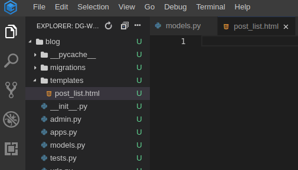
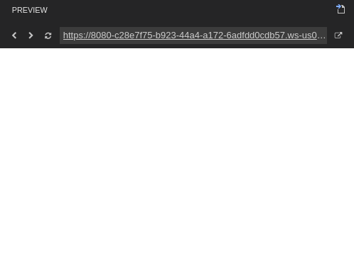
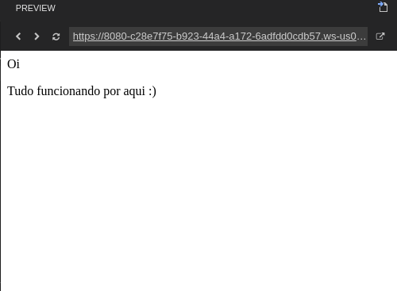

# Seu primeiro template!

Criar um template significa criar **um arquivo** de template. Tudo é um arquivo, certo? Provavelmente você já deve ter notado isso.

Os templates são salvos no diretório `blog/templates`. Então, crie um diretório \(clicando em _New Folder_\) chamado `templates` dentro do diretório do seu blog.

```text
blog
└───templates
```

E agora crie o arquivo `post_list.html` \(deixe-o em branco por agora\) dentro do diretório `blog/templates`.



Veja como o nosso site está se parecendo agora:

> Se ocorrer um erro de `TemplateDoesNotExist`, tente atualizar a página mais de uma vez ou clicar no ícone ao lado da URL do Preview do Django, no Gitpod. Caso continue sem funcionar, chame uma treinadora mais próxima.



Acabaram-se os erros! Parabéns :\) Entretanto, nosso site não mostra nada a não ser uma página em branco. Isso porque o nosso template está vazio. Então precisamos consertar isso. Adicione a seguinte linha dentro do `post_list.html`

```markup
<html>
    <p>Oi</p>
    <p>Tudo funcionando por aqui :)</p>
</html>
```

Como nosso site se parece agora? Entre no site para descobrir.



Funcionou! Bom trabalho :D

* A tag mais básica, `<html>`, estará sempre no começo de qualquer página da web, assim como, `</html>` sempre estará no fim. Como você pode ver, todo o conteúdo de um website se encontra entre a tag de início `<html>` e entre a tag de fim `</html>`
* `<p>` é a tag que denomina parágrafos; `</p>` determina o fim de cada parágrafo

