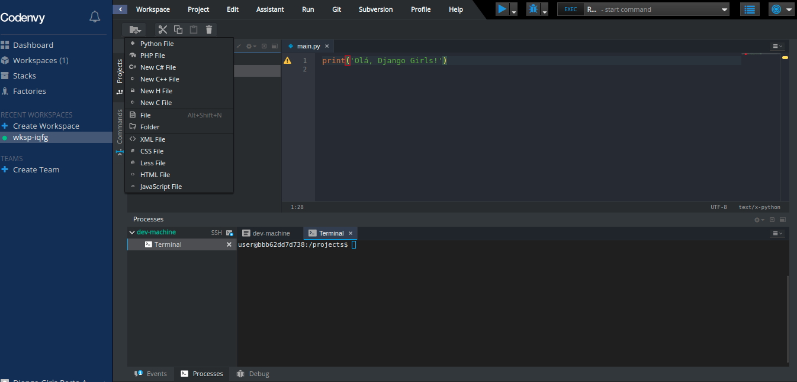

# README

Até agora nós escrevemos todo nosso código em um interpretador python, que nos limita a uma linha de código em um momento. Programas normais são salvos em arquivos e executados pelo nosso **interpretador** de linguagem de programação ou **compilador**. Até agora só executamos nossos programas de uma linha de cada vez no **interpretador Python**. Nós vamos precisar de mais de uma linha de código para as próximas tarefas, então precisaremos rapidamente:

* Sair do interpretador Python
* Abrir o editor de código
* Salvar algum código em um novo arquivo python
* Executá-lo!

Para sair do interpretador Python que estamos usando, simplesmente digite a função `exit(),` ou também você pode utilizar o comando `ctrl + D`

```text
>>> exit()
$
```

Isso vai colocá-la\(o\) no prompt de comando.

Nós precisamos criar um novo arquivo para escrever o código, para isso clique no primeiro botão como ícone de uma pasta em cima onde esta seu projeto 'Django Girls', depois em 'Python File':



Vamos chamar o arquivo de `python_intro.py` e salvá-lo. Podemos nomear o arquivo de tudo o que quisermos, o importante aqui é ter certeza que o arquivo termina com `py`, isto diz nosso computador que é um `arquivo executável de python` e Python pode executá-lo.

Agora você pode escrever seu programa.

```text
print('Olá, Django Girls!')
```

> Nota: Você deve observar que uma das coisas mais legais sobre editores de código: cores! No console do Python, tudo era da mesma cor, mas agora você deve ver que a função de `Imprimir` é uma cor diferente da sequência de caracteres no seu interior. Isso é chamado de `"realce de sintaxe"`, e é uma ajuda muito útil quando está programando. Perceba a cor das coisas e você vai obter uma dica para quando você esquecer de fechar uma seqüência de caracteres, ou fazer um erro de digitação em um nome de palavra-chave \(como `def` em uma função, que veremos abaixo\). Esta é uma das razões pelas quais nós usamos um editor de código :\)

Obviamente, você é um\(a\) desenvolvedor\(a\) python bastante experiente agora, então sinta-se livre para escrever um código que você aprendeu hoje.

Não esqueça de salvar as modificações no seu arquivo \(`Save File, ou utilize o atalho Ctrl + S`\). Com o arquivo salvo, é hora de executá-lo! Usando as habilidades que você aprendeu na seção de linha de comando, use o terminal para chegar na pasta em que seu arquivo foi salvo.

Se você ficar presa, peça ajuda.

Em seguida, usar o Python para executar o código no arquivo assim:

```text
$ python3 python_intro.py
Olá, Django Girls!
```

Tudo bem! Você acabou de executar seu primeiro programa em python que foi salvo em um arquivo.

Se sente bem?

Vamos descobrir mais coisas que podemos fazer com python então! :D

