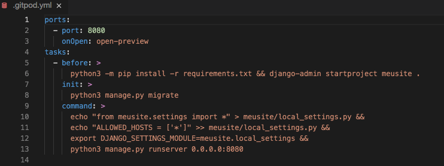

# Instalação do Django

## Instalando o Django <a id="instalando-o-django"></a>

Nós facilitamos um pouco o processo de instalação do Django. Deixamos tudo pronto pra sair botando a mão na massa! Se você está preparada, acesse este link: [https://gitpod.io/\#https://github.com/dgtaquara/dg-workspace](https://gitpod.io/#https://github.com/dgtaquara/dg-workspace)

## Uma breve explicação do que foi feito

No arquivo `.gitpod.yml`, como mostrado na figura abaixo, estão as configurações necessárias para rodar o Django. Você não precisa fazer nada!



O comando `pip install -r requirements.txt` instala o Django na versão 2.2.4, esta informação da versão está contida no arquivo `requirements.txt` que possui o seguinte conteúdo:

```text
Django~=2.2.4
```

Até aqui o Django já foi instalado. 

Agora, o primeiro passo é iniciar um novo projeto Django. Basicamente, isso significa que devemos rodar alguns scripts providos pelo Django que vão criar um esqueleto de projeto Django para nós. O resultado é um conjunto de diretórios e arquivos que nós iremos utilizar e modificar mais tarde.

O comando `django-admin startproject meusite .` inicia este projeto novo pra nós.

`django-admin` é um script que criará os diretórios e arquivos para você. Ele cria uma estrutura de diretório parecida com isso:

```text
djangogirls
├───manage.py
├───mysite
│        settings.py
│        urls.py
│        wsgi.py
│        __init__.py
└───requirements.txt
```

`manage.py` é um script que ajuda com a gestão do site. Com ele, podemos iniciar um servidor de web no nosso computador sem instalar nada, entre outras coisas.

O arquivo `settings.py` contém a configuração do seu site.

Lembra de quando falamos sobre um carteiro verificando onde entregar uma carta? O arquivo `urls.py` contém uma lista dos padrões usados por `urlresolver`.

Vamos ignorar os outros arquivos por enquanto pois não vamos modificá-los. Só precisamos lembrar de não excluí-los por acidentalmente!

### Configuração do Banco de Dados

Existem vários software de banco de dados diferentes que podem armazenar dados para o seu site. Nós vamos usar o padrão do Django, o `sqlite3`.

Isto já está configurado nesta parte do seu arquivo `meusite/settings.py`:

meusite/settings.py

```text
DATABASES = {
    'default': {
        'ENGINE': 'django.db.backends.sqlite3',
        'NAME': os.path.join(BASE_DIR, 'db.sqlite3'),
    }
}
```

O comando `python3 manage.py migrate` cria esse banco de dados pra nós.

### Inicializando o servidor web

O comando `python manage.py runserver 0.0.0.0:8080` que vocês podem ver nesse mesmo arquivo `.gitpod.yml`, é responsável por rodar a nossa aplicação.

Pronta para o colocar a mão na massa? Está na hora de criar conteúdo!


