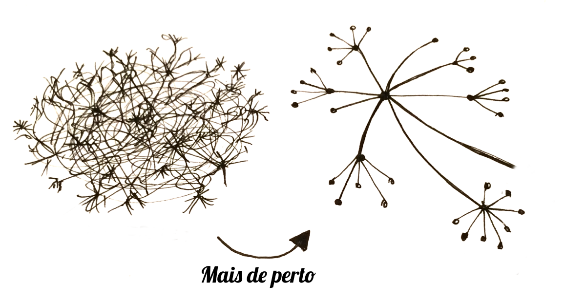
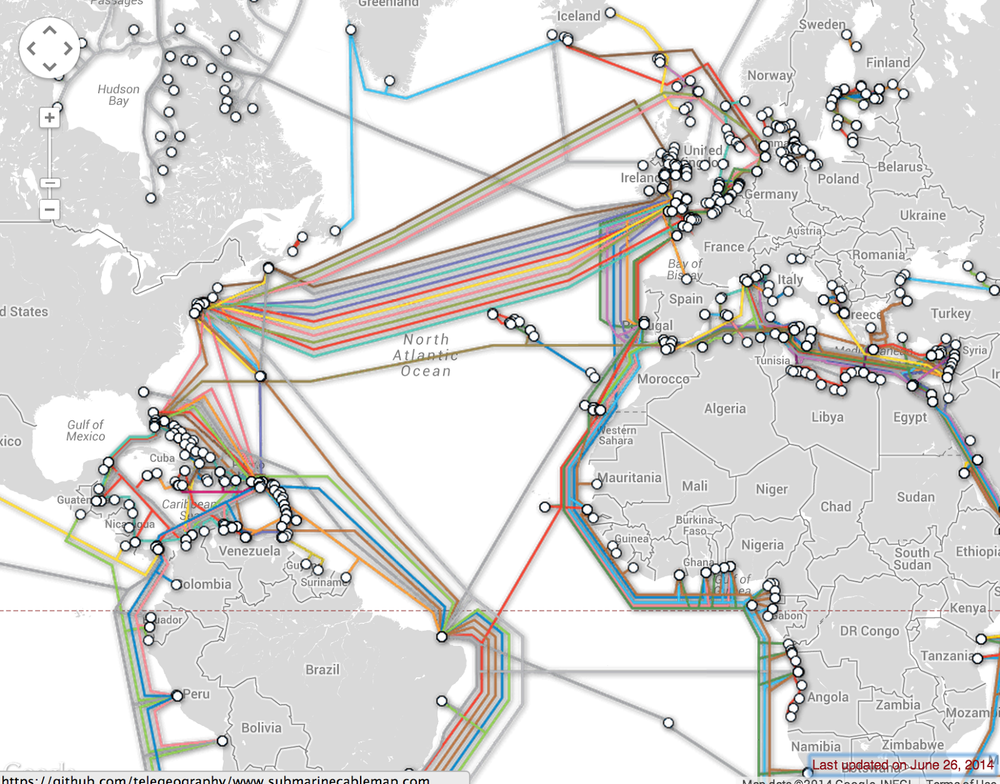

# Como funciona a internet?

> _Este capítulo é inspirado na palestra "Como a Internet funciona" de Jessica McKellar \(_[http://web.mit.edu/jesstess/www/](http://web.mit.edu/jesstess/www/)_\)._

Apostamos que você usa a Internet todos os dias. Mas você sabe realmente o que acontece quando você digita um endereço como [https://djangogirls/portoalegre](https://djangogirls.org/portoalegre/) em seu navegador e pressiona 'Enter'?

A primeira coisa que você precisa entender é que um site é só um monte de arquivos salvos em um disco rígido. Assim como os filmes, músicas ou fotos que você tem no computador. No entanto, existe uma parte que é exclusiva para sites: essa parte inclui código de computador chamado HTML.

Se você não estiver familiarizado\(a\) com programação, pode ser difícil compreender o HTML no começo, mas seu navegador web \(como o Chrome, Safari, Firefox, etc\) ama ele. Navegadores web são projetados para entender esse código, seguir suas instruções e apresentar todos esses arquivos de que seu site é feito, exatamente do jeito que você quer que eles sejam apresentados.

Igual a todos os outros arquivos, os arquivos HTML precisam ser armazenados em um disco rígido. Para a internet, nós usamos especiais e poderosos computadores chamados de servidores. Eles não têm tela, mouse ou teclado, porque sua finalidade principal é armazenar dados e servi-los. É por isso que eles são chamados de servidores..--porque eles servem, a você, dados.

OK, mas você quer saber com o quê a internet se parece, certo? Fizemos um desenho pra você! Veja:

Parece uma bagunça, não é? Na verdade é uma rede de máquinas conectadas \(os servidores mencionados acima\). Centenas de milhares de máquinas! Muitos, muitos quilômetros de cabos por todo o mundo! Para ver o quão complicada a internet é, você pode visitar um site [http://submarinecablemap.com/](http://submarinecablemap.com/) que mostra um mapa com os cabos submarinos. Aqui está uma captura de tela do site:

Fascinante, né? Mas, obviamente, não é possível ter um fio ligando todas as máquina conectadas à internet. Logo, para alcançar uma máquina \(por exemplo aquela onde [https://djangogirls.org](https://djangogirls.org/) está salva\), precisamos passar uma requisição por muitas máquinas diferentes.

É algo assim:

Imagine que quando digita [http://djangogirls.org](http://djangogirls.org/), você envia uma carta que diz: "Queridas Django Girls, eu desejo ver o site djangogirls.org. Enviem-no para mim, por favor!"

Sua carta vai para a agência dos correios mais próxima de você. Então, ela vai para outra agência um pouco mais perto do destinatário e, em seguida, para outra e outra até ser entregue. A única coisa diferente é que se você enviar muitas cartas \(_pacotes de dados_\) para o mesmo lugar, elas podem passar por agências totalmente diferentes \(_roteadores_\). Isso depende de como elas são distribuídas em cada agência.

Sim, é simples assim. Você envia mensagens e espera alguma resposta. Claro, ao invés de papel e caneta você usa bytes de dados, mas a ideia é a mesma!

Ao invés de endereços com o nome da rua, cidade, código postal e nome do país, na internet usamos endereços de IP. Primeiro seu computador pergunta pelo DNS \(Domain Name System - Sistema de Nome de Domínio\) para traduzir djangogirls.org para um endereço de IP. Isso funciona mais ou menos como as antigas listas telefônicas em que você podia procurar o número e endereço da pessoa que queria contactar.

Quando você envia uma carta, ela precisa ter certas características para ser entregue corretamente: um endereço, um selo, etc. E você usa uma linguagem que o destinatário compreende, certo? O mesmo se aplica aos _pacotes de dados_ que você envia para acessar um site. Nós usamos um protocolo chamado HTTP \(Hypertext Transfer Protocol\).

Então, de forma simplificada, um site precisa ter um _servidor_ \(máquina\) onde ele vive. Quando o _servidor_recebe uma _solicitação_ de entrada \(numa carta\), ele envia em respota seu website \(em outra carta\).

Este é um tutorial de Django, então você deve estar imaginando o que o Django faz. Quando envia uma resposta, nem sempre você quer mandar a mesma coisa para todo mundo. É muito melhor que as cartas sejam personalizadas, especialmente para a pessoa que acabou de nos escrever, né? O Django nos ajuda a criar essas cartas personalizadas. :\)

Chega de falar, é hora de criar!

