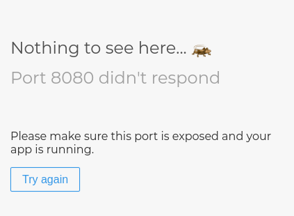

# blog/views.py

OK, vamos abrir o arquivo e ver o que tem nele:

```text
from django.shortcuts import render

# Create your views here.
```

Não tem muita coisa. Agora, a view mais básica deve se parecer com isto:

```text
from django.shortcuts import render

def post_list(request):
    return render(request, '../templates/post_list.html', {})
```

Como você pode ver, nós criamos um método \(`def`\) chamado `post_list` que aceita o pedido e **retorna** um método `render` será processado \(para montar\) nosso modelo `blog/post_list.html`.

Salve o arquivo, vá para seu endereço \(sem o `/admin`\) e veja o que temos.


OBS: Caso apareça algo como na imagem abaixo, rode novamente o seu servidor com o seguinte comando: `python3 manage.py runserver 8080`




Outro erro! Leia o que está acontecendo agora:

Esta é tranquila: _TemplateDoesNotExist_. Significa que seu arquivo de site não existe \(ainda!\). Vamos corrigir este bug e criar um arquivo de site no próximo capítulo!

> Aprenda mais sobre as views do Django lendo a documentação oficial: [https://docs.djangoproject.com/en/3.0/topics/http/views/](https://docs.djangoproject.com/en/3.0/topics/http/views/)

